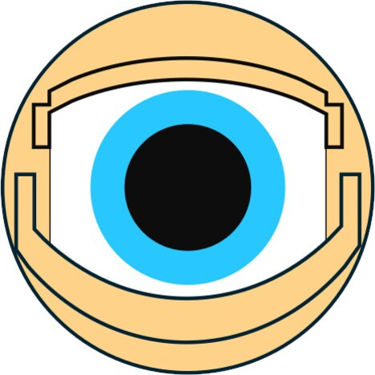
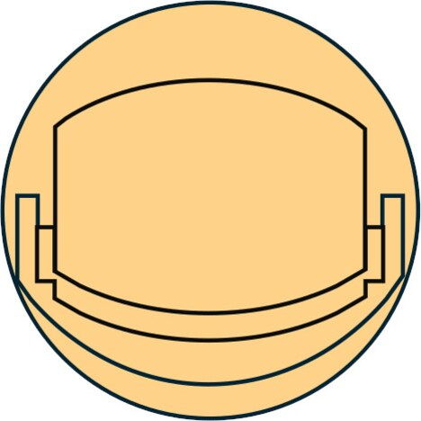

# M5CrazyEyes

M5Stack Stopwatch の画面に目の画像を表示し，ESP-NOW で受信した `eye_id` に応じて開閉状態を切り替えるファームウェアです。同じファームウェアを左右のデバイスへ書き込み，それぞれの `eye_id` を本体のボタンで設定できます。M5Stack Chain DualKey を使った専用コントローラーのファームウェアも含みます。

| 開いた状態 | 閉じた状態 |
| --- | --- |
|  |  |

## 動作仕様

- `eye_id` はデバイスごとに NVS へ保存します。左目は `L`，右目は `R` です。
- `eye_id` は本体のボタンで設定します。起動時にAボタンを1秒間長押しすると左目に，Bボタンを1秒間長押しすると右目になります。
- `eye_id` がない初回起動では，画面に `A = LEFT` / `B = RIGHT` を表示して，どちらかのボタンが押されるまで待ちます。
- 起動するたびに，設定されている側を `LEFT` または `RIGHT` として1秒間表示してから目を表示します。
- ESP-NOW のペイロードは，`eye_id` と操作コマンドからなる2バイトです。
- Chain DualKeyのキーを押している間は目を閉じ，離すと目を開きます。押し続ける時間に制限はありません。
- 短くタップしてから素早くもう一度押し続けると，押している間だけ高速まばたきします。
- 閉じる，または高速まばたきのコマンドが600ms間届かなければ，通信切断と判断して自動的に目を開きます。
- 開閉2枚の画像は起動時に一度だけデコードして PSRAM 上のキャンバスへ保持し，表示はキャンバスの転送だけで行います。1フレームあたり約30msで描画できるため，高速まばたきは設定どおり100ms間隔で切り替わります。
- `ESP_NOW_CHANNEL` は `0` です。この値は無線チャンネル0を表すのではなく，ライブラリ側で Wi-Fi チャンネルを固定しない設定です。
- `crazy-eyes-controller` は Chain DualKey のキー1へ左目を表す `L`，キー2へ右目を表す `R` を割り当て，開く，閉じる，高速まばたきのコマンドをブロードキャストします。

## 必要なもの

- M5Stack Stopwatch
  - 左右を同時に使う場合は2台必要です。
- M5Stack Chain DualKey
- データ通信に対応した USB ケーブル
- Git
- PlatformIO Core，または PlatformIO 対応の VS Code 拡張機能
  - PlatformIO Core 6.1.19 でビルドを確認しています。
- 初回ビルド時に依存パッケージを取得するためのインターネット接続

## セットアップ

設定ファイルを Git submodule として参照しているため，クローン時にサブモジュールも取得します。

```sh
git clone --recurse-submodules https://github.com/3110/M5CrazyEyes.git
cd M5CrazyEyes
```

すでに通常の `git clone` を実行した場合は，プロジェクトのルートで次を実行してください。

```sh
git submodule update --init --recursive
```

## ビルド

表示側の `crazy-eyes` はデフォルト環境です。

```sh
pio run
```

コントローラー側は環境名を指定してビルドします。

```sh
pio run -e crazy-eyes-controller
```

両方をまとめてビルドすることもできます。

```sh
pio run -e crazy-eyes -e crazy-eyes-controller
```

ビルド済みのファームウェアは，それぞれ次のディレクトリに生成されます。

```text
.pio/build/crazy-eyes/
.pio/build/crazy-eyes-controller/
```

## デバイスへの書き込み

### 表示側

M5Stack Stopwatch を USB で接続して，次を実行します。左右とも同じ `crazy-eyes` ファームウェアを書き込んでください。

```sh
pio run -e crazy-eyes -t upload
```

### コントローラー側

M5Stack Chain DualKey を USB で接続して，次を実行します。

```sh
pio run -e crazy-eyes-controller -t upload
```

複数のシリアルポートが見つかる場合は，ポートを確認して明示的に指定します。

```sh
pio device list
pio run -e crazy-eyes -t upload --upload-port /dev/cu.usbmodemXXXX
```

## コントローラー

`crazy-eyes-controller` は M5Stack Chain DualKey の2つのキーを監視し，`eye_id` と操作コマンドを ESP-NOW でブロードキャストします。

| Chain DualKey | `eye_id` |
| --- | --- |
| キー1 | `0x4C`（ASCII の `L`，左目） |
| キー2 | `0x52`（ASCII の `R`，右目） |

操作方法は次のとおりです。

| 操作 | 目の動作 |
| --- | --- |
| キーを押す | 閉じる |
| キーを押し続ける | 閉じた状態を維持する |
| キーを離す | 開く |
| 250ms以内の短いタップ後，300ms以内にもう一度押し続ける | 高速まばたきする |
| 高速まばたき中にキーを離す | 開く |

送信データは長さが2バイトで，1バイト目が `eye_id`，2バイト目が操作コマンドです。

| コマンド | 値 |
| --- | --- |
| 開く | `0x00` |
| 閉じる | `0x01` |
| 高速まばたき | `0x02` |

閉じるコマンドと高速まばたきコマンドは，キーを押している間，200ms間隔で再送します。高速まばたきの画像は表示側で100msごとに切り替えます。実装は [m5stack-esp-now のサンプル](https://github.com/3110/m5stack-esp-now/blob/main/examples/chain-dualkey-broadcast/main.cpp)をもとに，このプロジェクトに必要なキー入力とブロードキャスト処理を拡張しています。

## `eye_id` の設定

設定は本体の2つのボタンだけで行います。シリアルコンソールは不要です。

| 操作 | 結果 |
| --- | --- |
| Aボタンを押しながら起動し，1秒間押し続ける | 左目（`L`）として設定 |
| Bボタンを押しながら起動し，1秒間押し続ける | 右目（`R`）として設定 |
| どちらも押さずに起動 | 保存済みの設定で起動 |

長押しを要求しているのは，電源投入時にうっかり触れただけで設定が変わらないようにするためです。ボタンを離すのは，画面に `LEFT` または `RIGHT` が表示されてからにしてください。

### 初回設定

NVS に `eye_id` がない場合は，画面に次の表示が出て，どちらかのボタンが押されるまで待機します。この状態では長押しは不要で，短く押すだけで確定します。

```text
A = LEFT
B = RIGHT
```

### 設定の確認

起動するたびに，設定されている側を1秒間表示してから目の画像へ切り替わります。押すボタンを間違えた場合は，もう一度反対のボタンを押しながら起動し直してください。

115200 bpsのシリアルコンソールを開いていれば，同じ内容をログでも確認できます。

```text
Saved eye ID: R (right)
Using eye ID: R (right)
```

- 設定値は NVS に保存されるため，通常のファームウェア更新後も維持されます。
- 保存は値が変わるときだけ行います。同じ側を選び直しても NVS へは書き込みません。
- どちらの物理ボタンがAでBかは，`src/crazy-eyes/main.cpp` の `BTN_A_EYE_ID` と `BTN_B_EYE_ID` で入れ替えられます。

`crazy-eyes-controller` と組み合わせる場合は，左目の表示デバイスを `LEFT`，右目の表示デバイスを `RIGHT` に設定します。

## 使い方

1. `crazy-eyes` を書き込んだ表示デバイスを，Aボタンを押しながら起動して左目に，Bボタンを押しながら起動して右目に設定します。
2. `crazy-eyes-controller` を Chain DualKey へ書き込みます。
3. コントローラーと表示デバイスを起動します。
4. キー1を押している間は左目が，キー2を押している間は右目が閉じます。
5. キーを離すと，対応する目が開きます。
6. 高速まばたきさせる場合は，対象のキーを短くタップし，300ms以内にもう一度押し続けます。

コントローラーと表示デバイスは，同じ実際の Wi-Fi チャンネルを使用する必要があります。`ESP_NOW_CHANNEL=0` の場合，どちらもチャンネルを明示的に変更しません。

## カスタマイズ

### ESP-NOW のチャンネル

`platformio.ini` の次の定義でチャンネルを変更できます。

```ini
-DESP_NOW_CHANNEL=0
```

`ESP_NOW_CHANNEL=0` では Wi-Fi チャンネルを固定しません。チャンネルを明示する場合は1から13の範囲に変更し，送信側にも同じ実際の Wi-Fi チャンネルを設定してください。

### コントローラーの `eye_id`

コントローラーが送信する値は，`src/crazy-eyes-controller/main.cpp` の `KEY1_EYE_ID` と `KEY2_EYE_ID` で変更できます。表示側の NVS に設定した `eye_id` と一致させてください。

### 表示画像

次の JPEG ファイルを差し替えて再ビルドすると，表示する目を変更できます。

```text
data/crazy_eyes_open.jpg
data/crazy_eyes_close.jpg
```

画像はファームウェアへ埋め込まれ，起動時に一度だけデコードして PSRAM 上のキャンバスへ保持します。キャンバスは開いた目と閉じた目の2枚ぶんで，PSRAM を約876KB使用します。確保に失敗した場合は，表示のたびに JPEG をデコードする動作へ自動的に切り替わります。

デコードは起動時の一度だけなので，画像の形式は表示の速さには影響しませんが，起動時間を短くするには次の条件を満たす画像が有利です。

- 画面と同じ 468×468 ピクセル
  - 画面サイズと異なる場合は拡大縮小の処理が入り，デコードに数倍の時間がかかります。
- クロマサブサンプリングが 4:2:0 のベースライン JPEG
  - 4:4:4 の場合は MCU が 8×8 になり，デコードに時間がかかります。

ImageMagick で変換する場合の例です。

```sh
magick input.png -resize 468x468! -sampling-factor 4:2:0 -interlace none -quality 88 -strip data/crazy_eyes_open.jpg
```

## プロジェクト構成

```text
.
├── config/                    # M5Stack 向け共通 PlatformIO 設定（submodule）
├── data/                      # ファームウェアへ埋め込む開閉画像
├── include/                   # 表示側とコントローラーで共有する通信プロトコル
├── lib/CrazyEyes/             # 画面表示と開閉状態の管理
├── src/
│   ├── crazy-eyes/            # Stopwatch用の表示側ファームウェア
│   └── crazy-eyes-controller/ # Chain DualKey用のコントローラー
└── platformio.ini             # ビルド環境と依存ライブラリ
```

## トラブルシューティング

### `config/platformio-m5stack.ini` が見つからない

サブモジュールが取得されていません。プロジェクトのルートで次を実行してください。

```sh
git submodule update --init --recursive
```

### 書き込み先ポートが見つからない

USB ケーブルがデータ通信に対応していることを確認し，`pio device list` で認識されているポートを確認してください。複数のポートがある場合は，`--upload-port` で対象を指定します。

### ボタンを押しても `eye_id` が変わらない

ボタンは，リセットまたは電源投入の瞬間から押し続けてください。1秒間の長押しが必要です。画面に `LEFT` または `RIGHT` が表示されたら離して構いません。表示された側が期待と逆であれば，反対のボタンを押しながら起動し直してください。

### ESP-NOW を受信しても表示が変わらない

次の項目を確認してください。

- 送信側と受信側が同じ実際の Wi-Fi チャンネルを使用しているか
- ペイロードが `[eye_id, 操作コマンド]` の2バイトか
- 起動時に表示される `LEFT` / `RIGHT` と送信値が一致しているか
- 送信側と受信側が ESP-NOW で通信できる距離にあるか

### Chain DualKeyを押しても送信されない

`crazy-eyes-controller` 環境を書き込んでいることを確認してください。115200 bpsのシリアルコンソールを開くと，ESP-NOW の初期化失敗や送信失敗を確認できます。

## ライセンス

このプロジェクトは [MIT License](LICENSE) の下で公開されています。
